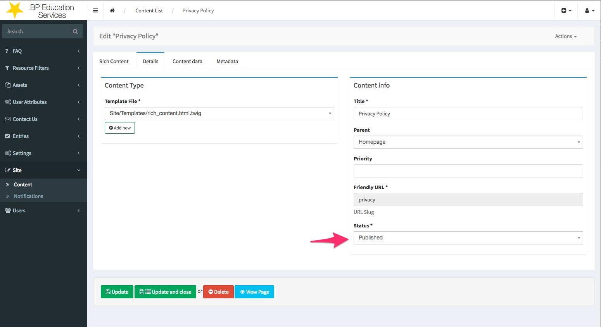
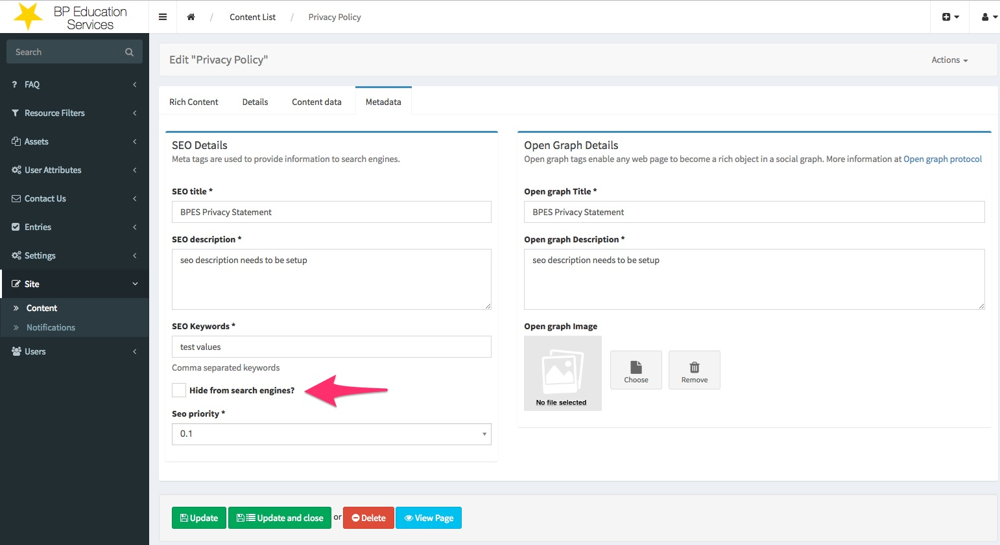
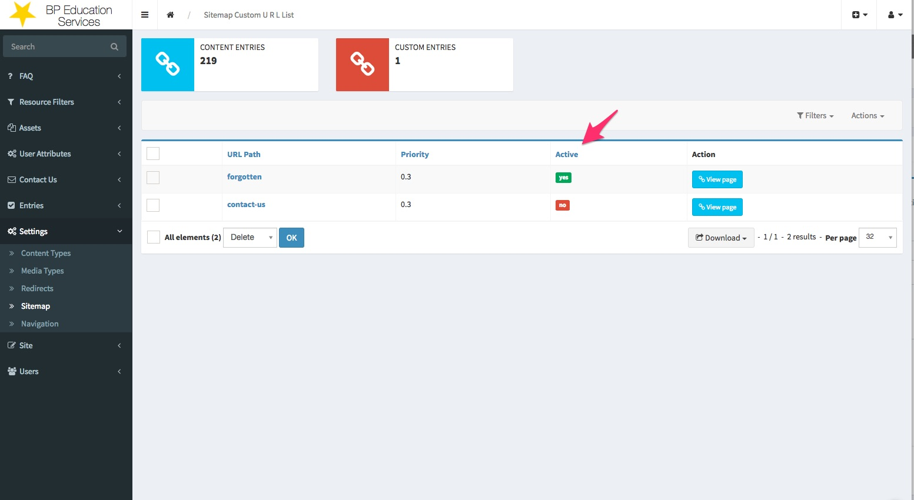

# Sitemap

The Sitemaps protocol allows a webmaster to inform search engines about URLs on a website that are available for crawling. 

A Sitemap is an XML file that lists the URLs for a site. It allows webmasters to include additional information about each URL: when it was last updated, how often it changes, and how important it is in relation to other URLs in the site.
This allows search engines to crawl the site more intelligently. 

## Implementation
The sitemap.xml is auto-generated including the pages from the following sources:

### Site content 
The content that will be included in the sitemap.xml **must be published and non-hidden from the Search engines**.

### Custom Sitemap entries
The entries that will be included in the sitemap.xml **must be active**.

## Schema support
The current implementation of a URL element supports the following properties:

- loc
- priority
- lastMod
- image

