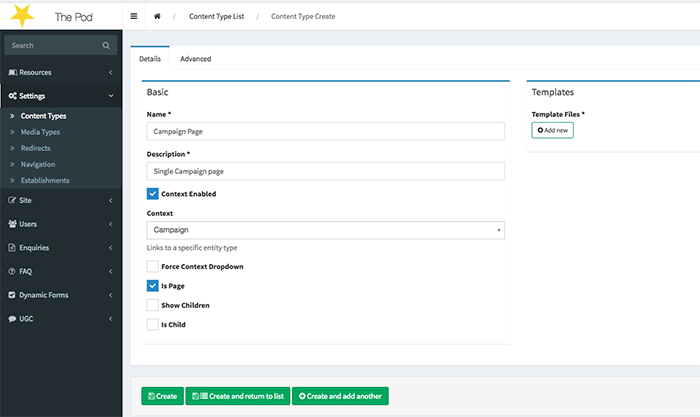
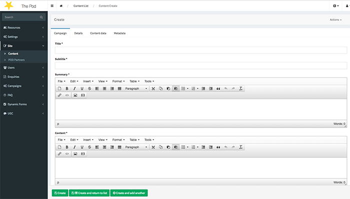

# Structure's Context

**Context** concept is another way of extending the data structure of a ContentType next to ContentType custom fields.
While ContentType custom fields gives you the ability to create dynamic fields for a ContentType through the CMS, the **Context** concept gives the ability of linking a Page/Structure with a Doctrine Entity.

### 1. Enable Context functionality
Enable context functionality from **edcoms\_cms\_content** bundle configuration as shown below:

``` 
edcoms_cms_content:
  structure:
    context_enabled: true
```

### 2. Create Context

Create a Doctrine entity by extending the **StructureContext** entity


```
namespace AppBundle\Entity\Campaign\Context;

use AppBundle\Entity\Campaign\Campaign;
use EdcomsCMS\ContentBundle\Entity\StructureContext;
use EdcomsCMS\ContentBundle\Annotation\StructureContext as Context;
use Doctrine\ORM\Mapping as ORM;

/**
 * Class CampaignContext
 * @package AppBundle\Campaign\Context
 *
 * @ORM\Entity()
 *
 * @Context(
 *     label = "Campaign",
 *     name = "campaign",
 *     form = "AppBundle\Form\Type\Campaign\CampaignType"
 * )
 */
class CampaignContext extends StructureContext
{

    /**
     * @var Campaign
     *
     * @ORM\OneToOne(targetEntity="AppBundle\Entity\Campaign\Campaign", cascade={"persist"}, inversedBy="context")
     * @ORM\JoinColumn(name="campaign_id", referencedColumnName="id")
     */
    protected $context;

    /**
     * @return Campaign
     */
    public function getContext()
    {
        return $this->context;
    }

    /**
     * @param Campaign $context
     */
    public function setContext($context)
    {
        $this->context = $context;
    }
}

```

**$context**:   
The entity where the underlying "Context" refers to.

**@Context**:   
The Context annotation is **auto-discoverable** as long as it is placed in the AppBundle\Entity directory. It consists of 3 properties:

- **label**: The label displayed in the CMS.
- **name**: A unique identifier of the underlying context type.
- **form**: The Symfony form that manages the underlying **Context**(Campaign in the example above)

If the Context class is not placed in the AppBundle\Entity directory, there is an alternative way of define it in the application, through **edcoms\_cms\_content** configuration as shown below:

```
edcoms_cms_content:
  structure:
    additional_context_classes:
      game_resource:
        context: AppBundle\Entity\Resource\GameResource
        label: 'Game resource'
        form: AppBundle\Form\Type\Resource\GameResourceType
        name: 'game_resource'
        context_class: EdcomsCMS\ResourcesBundle\EntityContext\ResourceContext

```

### 3. Create ContentType with Context

- Create a ContentType as usual
- Tick the Context Enabled field
- Select the Context from the dropdown



### 4. Create a Content/Page

- Create a Content of the respective ContentType as usual
- Now, the first tab should contain a form based to the Context **form** configuration of the previous step. (The data of the form will be mapped to a Doctrine entity; Campaign in the example above )




### More


#### Bidirectional relationship
Most of the times it is handy to have a reference to the Structure from the Doctrine entity. To do that, just create a mapped Doctrine relationship back to the StructureContext class as shown below:

```
/**
 * Class Campaign
 * @package AppBundle\Entity\Campaign
 *
 * @ORM\Entity
 */
class Campaign implements

    /**
     * @var CampaignContext
     * @ORM\OneToOne(targetEntity="AppBundle\Entity\Campaign\Context\CampaignContext", mappedBy="context")
     */
    private $context;
    
```

The relationship can be either **OneToOne** or **OneToMany** according to the business logic of the application.
